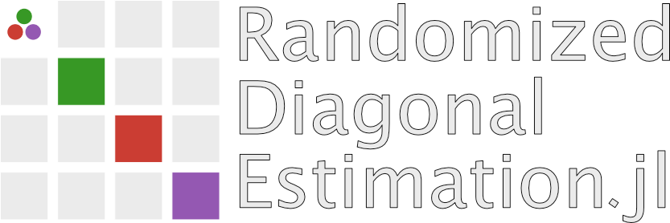

 

## Overview

This package is a suite for the randomized estimation of matrix diagonals and matrix function diagonals written in Julia. The methods in the current version of  package
include:

- Girad-Hutchinson Diagonal Estimator
- Diag++
- NysDiag++
- XDiag
- ADiag++
- FunDiag with three different function approximators (Remez Polynomials, Chebyshevs interpolants and Arnoldi Approximations)
- FunDiag++

## Documentation

For information on using the package,
[see the stable documentation](https://niclaspopp.github.io/RandomizedDiagonalEstimation.jl/dev/).

## Declaration, Contributing and Citing

The software in this packages was developed as part of my master thesis within the scope of only a few months. I have tested the code thoroughly to the best of my knowledge. However, if you find any bugs, I would be grateful if you let me know (e.g. through opening an issue) such that I can continuously improve the quality and stability of the package. Furthermore, I also intend to include future methods to keep the software as up-to-date as possible. In case you have developed a new method for randomized diagonal estimation, I would be very happy to receive a contribution and we can gladly include the method in the package. Otherwise, please feel free to star the repository to stay up to date. If you use RandomizedDiagonalEstimation.jl for research, teaching, or other activities, I would be grateful if you cite this work. [Link](will be updated).
